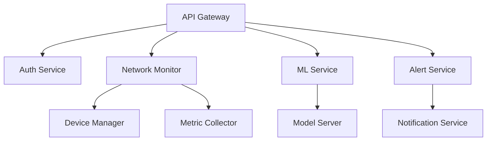

# EyeNet - Network Monitoring & Analysis Platform


EyeNet is a comprehensive network monitoring and analysis platform that combines real-time monitoring, ML-based analysis, and automated response capabilities. It provides enterprise-grade network visibility, predictive maintenance, and intelligent alerting.

## 🌟 Features

### 🔍 Network Monitoring
- Real-time device discovery and monitoring
- Network topology mapping and visualization
- Performance metrics collection and analysis
- Bandwidth and traffic monitoring
- Device health tracking

### 🤖 ML Capabilities
- Anomaly detection
- Predictive maintenance
- Traffic pattern analysis
- Security threat detection
- Automated response recommendations

### ⚡ Real-time Updates
- WebSocket-based real-time metrics
- Live status updates
- Instant alert notifications
- Dynamic topology changes
- ML prediction streaming

### 🔔 Alert Management
- Configurable alert thresholds
- Multiple notification channels
- Alert correlation
- Escalation policies
- Response tracking

## 🏗️ System Architecture



## 🚀 Getting Started

### Prerequisites
- Node.js >= 20.x
- Docker & Docker Compose
- Git

### Installation

1. **Clone the Repository**
```bash
git clone https://github.com/tadashijei/P-Eye.git
cd eyenet
```

2. **Set Up Environment Variables**
```bash
cd backend
cp .env.example .env
# Edit .env with your configuration
```

3. **Start with Docker**
```bash
docker-compose up -d
```

4. **Access Services**
- Backend API: http://localhost:5000
- API Documentation: http://localhost:5000/api-docs
- MongoDB UI: http://localhost:8081
- Redis UI: http://localhost:8082

### Manual Setup (Development)

1. **Install Backend Dependencies**
```bash
cd backend
npm install
```

2. **Start Development Server**
```bash
npm run dev
```

## 📚 Documentation

### API Documentation
- [OpenAPI/Swagger Documentation](backend/swagger.yaml)
- Access interactive documentation at `/api-docs` endpoint

### Guides
- [Network Monitoring Guide](documentation/network-monitoring-guide.md)
- [Alert Configuration Guide](documentation/alert-configuration-guide.md)
- [ML Integration Guide](documentation/ml-integration-guide.md)
- [WebSocket Events Documentation](documentation/websocket-events.md)
- [System Architecture Documentation](documentation/system-architecture.md)

## 🛠️ Development

### Project Structure
```
eyenet/
├── backend/
│   ├── src/
│   │   ├── config/
│   │   ├── middleware/
│   │   ├── models/
│   │   ├── routes/
│   │   ├── services/
│   │   └── utils/
│   ├── tests/
│   └── swagger.yaml
├── documentation/
│   ├── api/
│   ├── guides/
│   └── assets/
└── docker-compose.yml
```

### Key Components

#### Backend Services
- **API Gateway**: Main entry point for HTTP requests
- **WebSocket Server**: Real-time updates and streaming
- **Network Monitor**: Device discovery and metrics collection
- **ML Service**: Anomaly detection and predictions
- **Alert Service**: Alert management and notifications

#### Infrastructure
- **MongoDB**: Primary database
- **Redis**: Caching and real-time features
- **Docker**: Containerization and deployment

### Testing

```bash
# Run all tests
npm test

# Run specific test suite
npm test -- --grep "Auth"

# Run tests with coverage
npm run test:coverage
```

## 🔒 Security

### Authentication
- JWT-based authentication
- OAuth 2.0 support (Google, GitHub)
- API key management
- Role-based access control

### Data Protection
- Encrypted sensitive data
- Secure credential storage
- Rate limiting
- Input validation

## 🚦 API Rate Limits

| Endpoint Category | Rate Limit |
|------------------|------------|
| Authentication   | 10/minute  |
| Device Metrics   | 100/minute |
| ML Predictions   | 50/minute  |
| Alert Operations | 30/minute  |

## 🔧 Configuration

### Environment Variables
```env
# Server Configuration
PORT=5000
NODE_ENV=development

# MongoDB Configuration
MONGODB_URI=mongodb://localhost:27017/eyenet

# Redis Configuration
REDIS_URL=redis://localhost:6379

# JWT Configuration
JWT_SECRET=your_jwt_secret
JWT_EXPIRES_IN=1h

# ML Service Configuration
ML_MODEL_PATH=./ml_models
ML_MAX_BATCH_SIZE=16
```

### Docker Configuration
See [docker-compose.yml](docker-compose.yml) for complete configuration options.

## 🔍 Monitoring & Debugging

### Logging
- Structured logging with Winston
- Log levels: error, warn, info, debug
- Timestamp and context information
- Request/response logging

### Metrics
- System health metrics
- API response times
- Cache hit rates
- ML model performance
- Resource utilization

## 🤝 Contributing

1. Fork the repository
2. Create your feature branch (`git checkout -b feature/AmazingFeature`)
3. Commit your changes (`git commit -m 'Add some AmazingFeature'`)
4. Push to the branch (`git push origin feature/AmazingFeature`)
5. Open a Pull Request

### Coding Standards
- ESLint configuration
- Prettier formatting
- Jest for testing
- JSDoc documentation

## 📄 License

This project is licensed under the MIT License - see the [LICENSE](LICENSE) file for details.

## 🙏 Acknowledgments

- [Express.js](https://expressjs.com/)
- [Socket.IO](https://socket.io/)
- [Mongoose](https://mongoosejs.com/)
- [Redis](https://redis.io/)
- [Docker](https://www.docker.com/)

## 📞 Support

For support and questions:
- Create an issue in the repository
- Contact: support@eyenet.com
- Documentation: https://docs.eyenet.com

## 🗺️ Roadmap

### Upcoming Features
- [ ] Advanced ML models
- [ ] Enhanced visualization
- [ ] Mobile application
- [ ] Integration APIs
- [ ] Automated remediation

### Version History
- v1.0.0 - Initial release
- v1.1.0 - Added ML capabilities
- v1.2.0 - Enhanced real-time features
- v1.3.0 - Improved alert management
