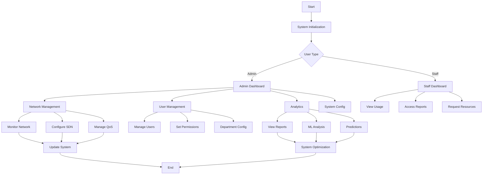

# Main System Flow

```mermaid
graph TD
    A[Start] --> B[System Initialization]
    B --> C{User Type}
    C -->|Admin| D[Admin Dashboard]
    C -->|Staff| E[Staff Dashboard]
    
    D --> F[Network Management]
    D --> G[User Management]
    D --> H[Analytics]
    D --> I[System Config]
    
    F --> J[Monitor Network]
    F --> K[Configure SDN]
    F --> L[Manage QoS]
    
    G --> M[Manage Users]
    G --> N[Set Permissions]
    G --> O[Department Config]
    
    H --> P[View Reports]
    H --> Q[ML Analysis]
    H --> R[Predictions]
    
    E --> S[View Usage]
    E --> T[Access Reports]
    E --> U[Request Resources]
    
    J --> V[Update System]
    K --> V
    L --> V
    
    P --> W[System Optimization]
    Q --> W
    R --> W
    
    V --> X[End]
    W --> X
```
