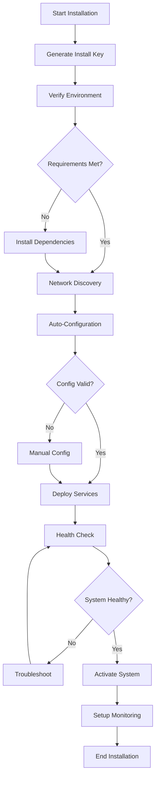

# Installation System Flow

```mermaid
graph TD
    A[Start Installation] --> B[Generate Install Key]
    B --> C[Verify Environment]
    C --> D{Requirements Met?}
    
    D -->|No| E[Install Dependencies]
    D -->|Yes| F[Network Discovery]
    
    E --> F
    F --> G[Auto-Configuration]
    G --> H{Config Valid?}
    
    H -->|No| I[Manual Config]
    H -->|Yes| J[Deploy Services]
    I --> J
    
    J --> K[Health Check]
    K --> L{System Healthy?}
    
    L -->|No| M[Troubleshoot]
    L -->|Yes| N[Activate System]
    M --> K
    
    N --> O[Setup Monitoring]
    O --> P[End Installation]
```
