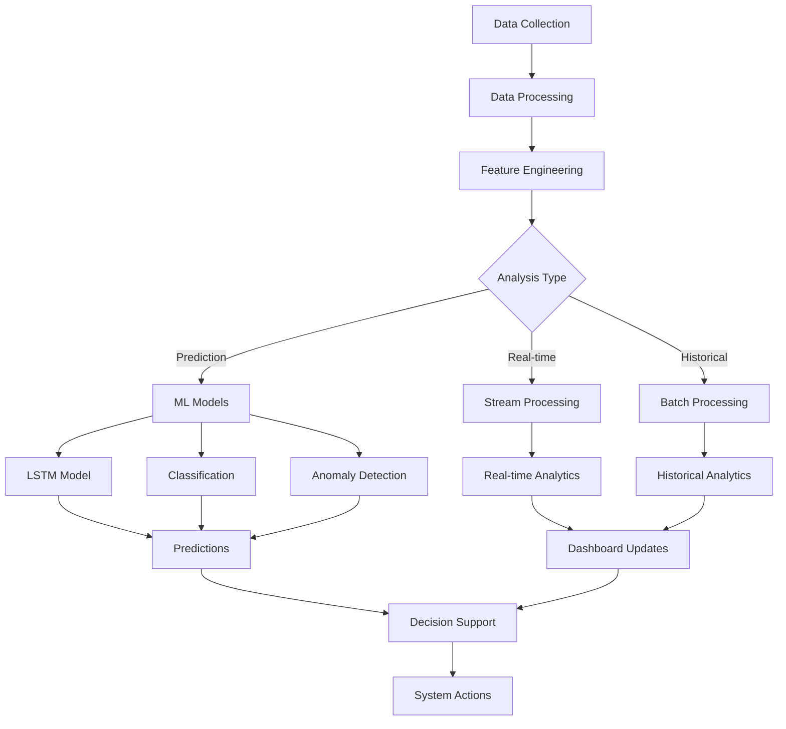

# ML & Analytics Flow

```mermaid
graph TD
    A[Data Collection] --> B[Data Processing]
    B --> C[Feature Engineering]
    C --> D{Analysis Type}
    
    D -->|Prediction| E[ML Models]
    D -->|Real-time| F[Stream Processing]
    D -->|Historical| G[Batch Processing]
    
    E --> H[LSTM Model]
    E --> I[Classification]
    E --> J[Anomaly Detection]
    
    F --> K[Real-time Analytics]
    G --> L[Historical Analytics]
    
    H --> M[Predictions]
    I --> M
    J --> M
    K --> N[Dashboard Updates]
    L --> N
    
    M --> O[Decision Support]
    N --> O
    O --> P[System Actions]
```
