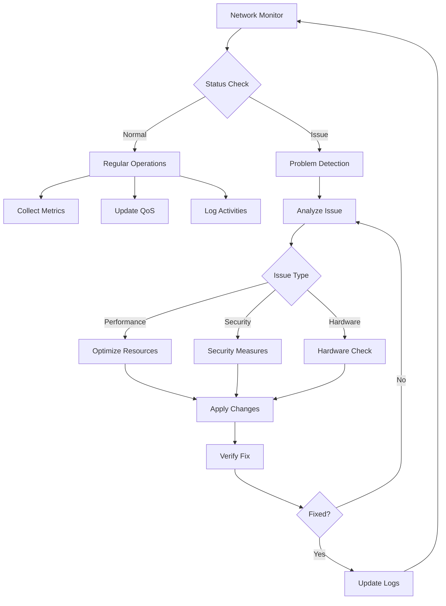

# Network Management Flow

```mermaid
graph TD
    A[Network Monitor] --> B{Status Check}
    B -->|Normal| C[Regular Operations]
    B -->|Issue| D[Problem Detection]
    
    C --> E[Collect Metrics]
    C --> F[Update QoS]
    C --> G[Log Activities]
    
    D --> H[Analyze Issue]
    H --> I{Issue Type}
    
    I -->|Performance| J[Optimize Resources]
    I -->|Security| K[Security Measures]
    I -->|Hardware| L[Hardware Check]
    
    J --> M[Apply Changes]
    K --> M
    L --> M
    
    M --> N[Verify Fix]
    N --> O{Fixed?}
    
    O -->|No| H
    O -->|Yes| P[Update Logs]
    P --> A
```
