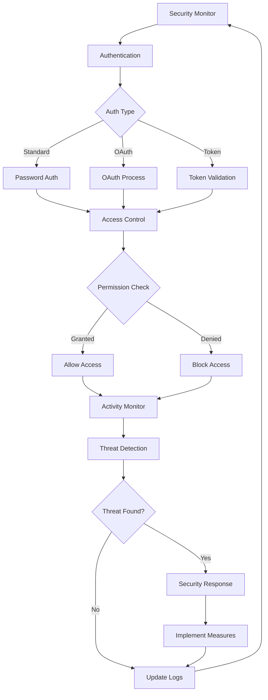

# Security System Flow

```mermaid
graph TD
    A[Security Monitor] --> B[Authentication]
    B --> C{Auth Type}
    
    C -->|Standard| D[Password Auth]
    C -->|OAuth| E[OAuth Process]
    C -->|Token| F[Token Validation]
    
    D --> G[Access Control]
    E --> G
    F --> G
    
    G --> H{Permission Check}
    H -->|Granted| I[Allow Access]
    H -->|Denied| J[Block Access]
    
    I --> K[Activity Monitor]
    J --> K
    
    K --> L[Threat Detection]
    L --> M{Threat Found?}
    
    M -->|Yes| N[Security Response]
    M -->|No| O[Update Logs]
    
    N --> P[Implement Measures]
    P --> O
    O --> A
```
