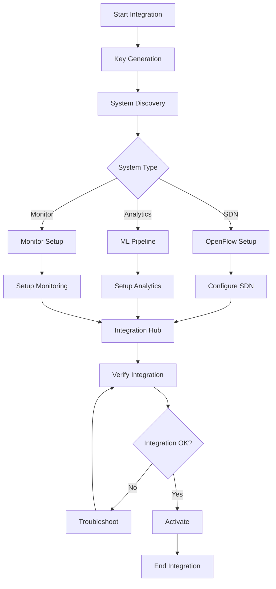

# Integration System Flow

```mermaid
graph TD
    A[Start Integration] --> B[Key Generation]
    B --> C[System Discovery]
    
    C --> D{System Type}
    D -->|SDN| E[OpenFlow Setup]
    D -->|Analytics| F[ML Pipeline]
    D -->|Monitor| G[Monitor Setup]
    
    E --> H[Configure SDN]
    F --> I[Setup Analytics]
    G --> J[Setup Monitoring]
    
    H --> K[Integration Hub]
    I --> K
    J --> K
    
    K --> L[Verify Integration]
    L --> M{Integration OK?}
    
    M -->|No| N[Troubleshoot]
    M -->|Yes| O[Activate]
    
    N --> L
    O --> P[End Integration]
```
