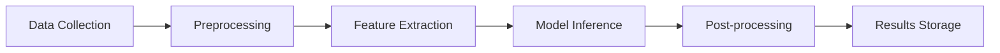

# ML Integration Guide

## Overview
This guide explains how to integrate and use the Machine Learning capabilities of the EyeNet system. The ML system provides anomaly detection, predictive maintenance, and network behavior analysis.

## ML Components

### 1. ML Pipeline


### 2. Supported Models
1. Anomaly Detection
2. Traffic Classification
3. Device Behavior Analysis
4. Predictive Maintenance
5. Security Threat Detection

## Integration Methods

### 1. REST API Integration

#### Single Prediction
```javascript
POST /api/ml/predict
Content-Type: multipart/form-data
{
  "image": <binary_data>,
  "options": {
    "model": "anomaly_detection",
    "threshold": 0.85,
    "features": ["all"]
  }
}
```

#### Batch Processing
```javascript
POST /api/ml/predict/batch
{
  "items": [{
    "id": "item_1",
    "data": {
      "metrics": [...],
      "timestamp": "2025-01-03T07:14:57+08:00"
    }
  }],
  "options": {
    "model": "traffic_classification",
    "batchSize": 32
  }
}
```

### 2. WebSocket Integration

#### Real-time Predictions
```javascript
// Subscribe to ML predictions
socket.emit('subscribe', {
  type: 'ml:predictions',
  models: ['anomaly_detection', 'traffic_classification']
});

// Handle prediction results
socket.on('ml:prediction', (result) => {
  console.log('New prediction:', result);
});
```

## Model Configuration

### 1. Anomaly Detection

```javascript
POST /api/ml/config/anomaly-detection
{
  "model": {
    "type": "isolation_forest",
    "parameters": {
      "contamination": 0.1,
      "n_estimators": 100
    }
  },
  "features": {
    "metrics": ["cpu", "memory", "network_io"],
    "window_size": 3600,  // 1 hour
    "aggregation": "mean"
  }
}
```

### 2. Traffic Classification

```javascript
POST /api/ml/config/traffic-classification
{
  "model": {
    "type": "deep_learning",
    "architecture": "cnn",
    "parameters": {
      "layers": [64, 128, 256],
      "dropout": 0.3
    }
  },
  "classes": [
    "normal",
    "ddos",
    "port_scan",
    "data_exfiltration"
  ]
}
```

## Data Processing

### 1. Feature Engineering

#### Time-series Features
```javascript
{
  "features": {
    "statistical": ["mean", "std", "min", "max"],
    "temporal": ["hour", "day", "week"],
    "derived": ["rate_of_change", "acceleration"]
  }
}
```

#### Network Features
```javascript
{
  "features": {
    "topology": ["degree", "centrality", "clustering"],
    "traffic": ["volume", "pattern", "protocol"],
    "behavior": ["connection_pattern", "packet_size"]
  }
}
```

### 2. Data Preprocessing

```javascript
POST /api/ml/preprocessing/config
{
  "steps": [{
    "type": "normalization",
    "method": "min_max",
    "parameters": {
      "feature_range": [-1, 1]
    }
  }, {
    "type": "missing_values",
    "method": "interpolation",
    "parameters": {
      "method": "linear"
    }
  }]
}
```

## Model Management

### 1. Model Versioning
```javascript
GET /api/ml/models
{
  "models": [{
    "id": "anomaly_detection_v1",
    "version": "1.0.0",
    "created": "2025-01-03T07:14:57+08:00",
    "metrics": {
      "accuracy": 0.95,
      "f1_score": 0.94
    }
  }]
}
```

### 2. Model Deployment
```javascript
POST /api/ml/models/deploy
{
  "modelId": "anomaly_detection_v1",
  "environment": "production",
  "rollback": {
    "enabled": true,
    "threshold": {
      "metric": "accuracy",
      "minimum": 0.90
    }
  }
}
```

## Performance Monitoring

### 1. Metrics Collection
```javascript
GET /api/ml/metrics
{
  "period": "1h",
  "metrics": [
    "prediction_latency",
    "throughput",
    "accuracy",
    "resource_usage"
  ]
}
```

### 2. Performance Optimization
```javascript
POST /api/ml/optimize
{
  "target": {
    "metric": "latency",
    "goal": "minimize"
  },
  "constraints": {
    "accuracy": {
      "minimum": 0.9
    },
    "memory": {
      "maximum": "2GB"
    }
  }
}
```

## Best Practices

### 1. Model Development
- Use version control for models
- Document model architecture
- Track experiment results
- Implement A/B testing
- Monitor model drift

### 2. Production Deployment
- Use staging environment
- Implement gradual rollout
- Monitor performance metrics
- Set up alerting
- Plan for rollbacks

### 3. Data Management
- Implement data validation
- Set up data versioning
- Monitor data quality
- Handle missing values
- Document data pipeline

## Troubleshooting

### Common Issues
1. **Model Performance**
   - Check input data quality
   - Verify preprocessing steps
   - Monitor resource usage
   - Review model metrics

2. **Integration Problems**
   - Validate API endpoints
   - Check authentication
   - Verify data formats
   - Monitor error logs

3. **Resource Usage**
   - Monitor memory usage
   - Track CPU utilization
   - Check disk space
   - Monitor network bandwidth

## Security Considerations

### 1. Data Protection
- Encrypt sensitive data
- Implement access control
- Secure model artifacts
- Monitor access logs

### 2. Model Security
- Protect model endpoints
- Validate input data
- Monitor for attacks
- Implement rate limiting
