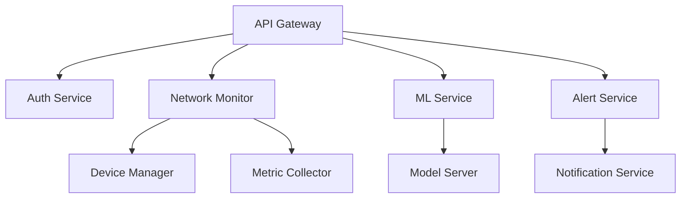
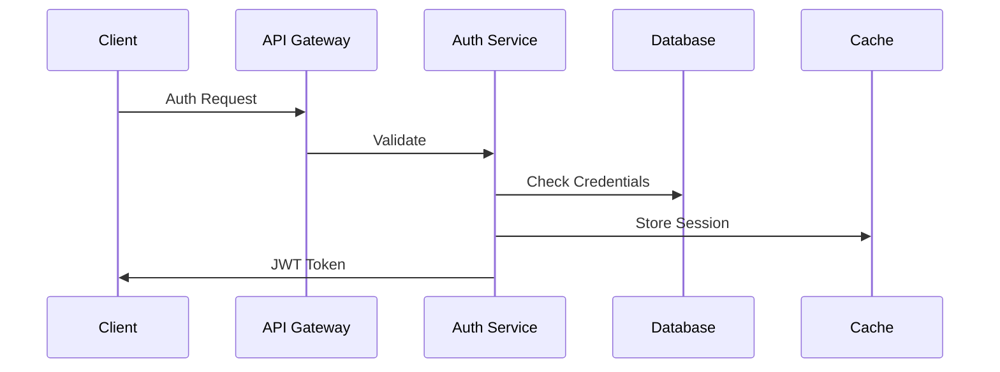
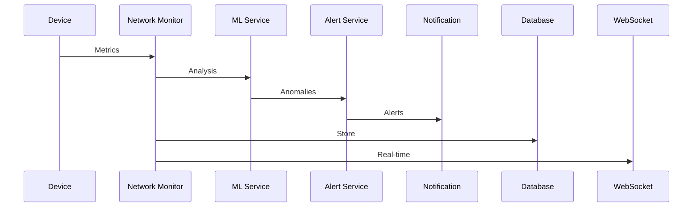
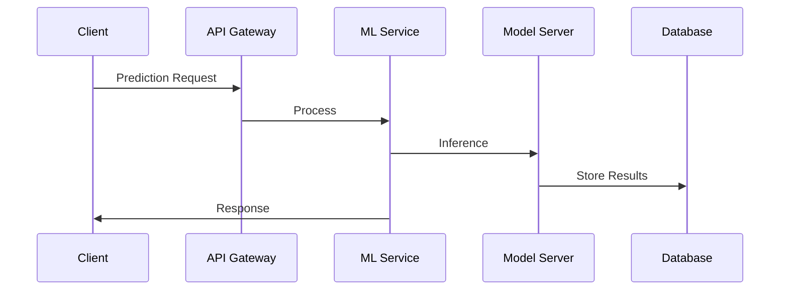

# System Architecture Documentation

## Overview
This document describes the architecture of the EyeNet system, a comprehensive network monitoring and analysis platform that combines real-time monitoring, ML-based analysis, and automated response capabilities.

## System Components

### 1. Core Services


#### API Gateway
- Route management
- Request validation
- Rate limiting
- Authentication
- Load balancing

#### Auth Service
- User management
- JWT handling
- Role-based access
- Session management
- OAuth integration

#### Network Monitor
- Device discovery
- Topology mapping
- Metric collection
- Status tracking
- Performance analysis

#### ML Service
- Model inference
- Batch processing
- Feature extraction
- Anomaly detection
- Prediction serving

#### Alert Service
- Rule evaluation
- Alert generation
- Notification dispatch
- Alert lifecycle
- Escalation management

### 2. Data Storage

#### Primary Database (MongoDB)
```javascript
// Collections structure
{
  "users": {
    "indexes": ["email", "username"],
    "sharding": "hash"
  },
  "devices": {
    "indexes": ["name", "type", "location"],
    "sharding": "ranged"
  },
  "metrics": {
    "indexes": ["timestamp", "deviceId"],
    "timeToLive": "30d"
  }
}
```

#### Time Series Database (Optional)
- High-frequency metrics
- Historical data
- Performance analysis
- Trend calculation

#### Cache Layer (Redis)
- Session data
- API responses
- Metric buffers
- ML predictions

### 3. Communication

#### REST API
- HTTP/2 enabled
- JSON payloads
- OpenAPI/Swagger
- Rate limiting
- Compression

#### WebSocket
- Real-time updates
- Metric streaming
- Alert notifications
- Bi-directional
- Auto-reconnect

#### Message Queue
- Event processing
- Task distribution
- Async operations
- Retry mechanism

## System Flows

### 1. Authentication Flow


### 2. Monitoring Flow


### 3. ML Processing Flow


## Deployment Architecture

### 1. Container Structure
```yaml
version: '3.8'
services:
  api-gateway:
    image: eyenet/api-gateway
    scale: 2
    
  auth-service:
    image: eyenet/auth
    scale: 2
    
  network-monitor:
    image: eyenet/monitor
    scale: 3
    
  ml-service:
    image: eyenet/ml
    scale: 2
    
  alert-service:
    image: eyenet/alert
    scale: 2
```

### 2. Scaling Strategy
- Horizontal scaling
- Load balancing
- Service discovery
- Health checks
- Auto-recovery

### 3. High Availability
- Service redundancy
- Data replication
- Failover handling
- Backup strategy
- Disaster recovery

## Security Architecture

### 1. Authentication
- JWT tokens
- OAuth 2.0
- API keys
- Role-based access
- Session management

### 2. Network Security
- TLS encryption
- API gateway
- Firewalls
- Rate limiting
- DDoS protection

### 3. Data Security
- Encryption at rest
- Secure transmission
- Access logging
- Audit trails
- Compliance

## Performance Considerations

### 1. Caching Strategy
```javascript
{
  "cache": {
    "api": {
      "ttl": 300,
      "strategy": "lru"
    },
    "metrics": {
      "ttl": 60,
      "strategy": "sliding"
    },
    "ml": {
      "ttl": 3600,
      "strategy": "predictive"
    }
  }
}
```

### 2. Database Optimization
- Indexing strategy
- Sharding setup
- Query optimization
- Connection pooling
- Data lifecycle

### 3. Resource Management
- CPU allocation
- Memory limits
- Disk quotas
- Network bandwidth
- Container resources

## Monitoring and Logging

### 1. System Metrics
- Service health
- Resource usage
- Response times
- Error rates
- Queue lengths

### 2. Application Logs
- Structured logging
- Log aggregation
- Search capability
- Retention policy
- Alert integration

### 3. Performance Metrics
- API latency
- Database performance
- Cache hit rates
- ML inference time
- Network throughput

## Disaster Recovery

### 1. Backup Strategy
- Database backups
- Configuration backups
- Model artifacts
- System state
- Recovery procedures

### 2. Failover Process
- Service redundancy
- Data replication
- Automatic failover
- Manual override
- Recovery validation

## Development Workflow

### 1. Version Control
- Feature branches
- Pull requests
- Code review
- CI/CD pipeline
- Release management

### 2. Testing Strategy
- Unit tests
- Integration tests
- Load testing
- Security testing
- Acceptance criteria

### 3. Deployment Process
- Blue-green deployment
- Canary releases
- Rollback capability
- Environment promotion
- Release validation

## Future Considerations

### 1. Scalability
- Service mesh
- Kubernetes adoption
- Global distribution
- Edge computing
- Serverless components

### 2. Features
- Advanced analytics
- AI/ML expansion
- Automation
- Integration options
- User experience

### 3. Technology
- Framework updates
- Security enhancements
- Performance optimization
- Tool modernization
- Standard compliance
