# EyeNet Technical Diagrams

## 1. System Architecture

### High-Level Architecture
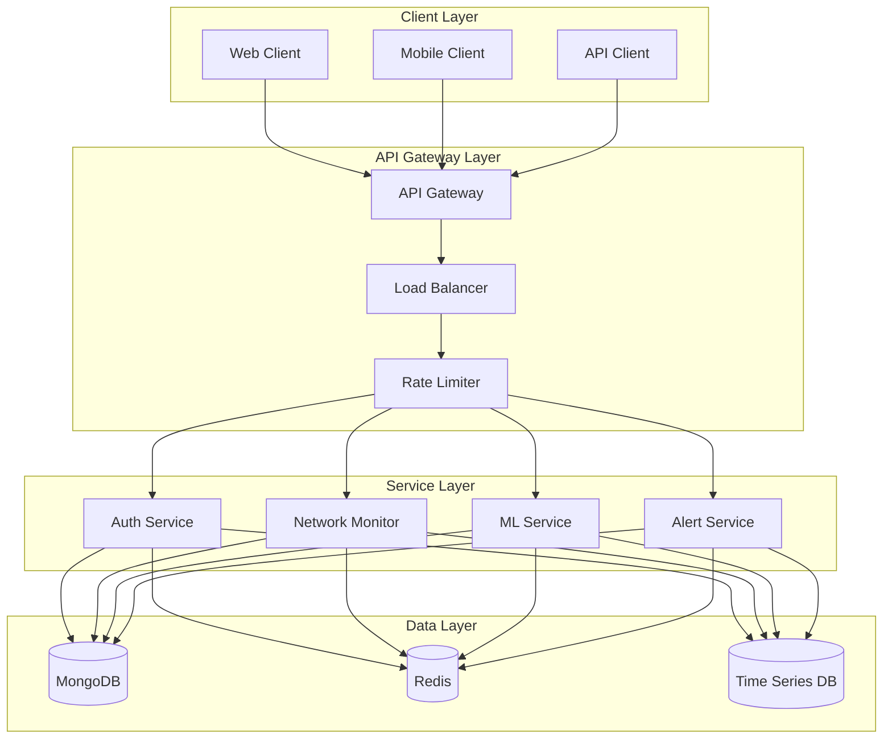

### Data Flow
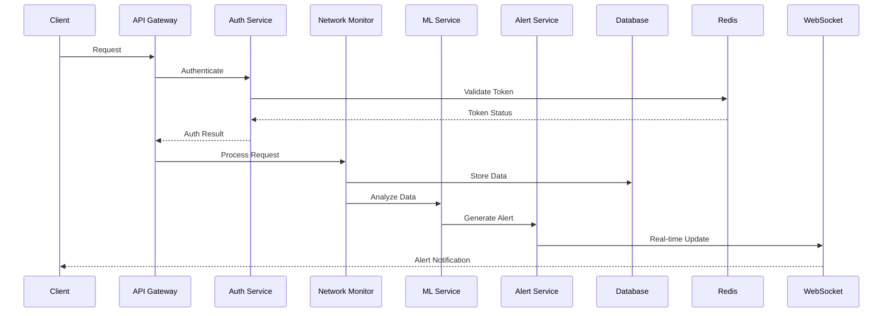

## 2. Network Monitoring

### Device Discovery Process
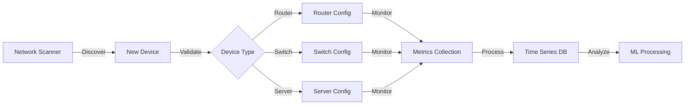

### Metric Collection Flow
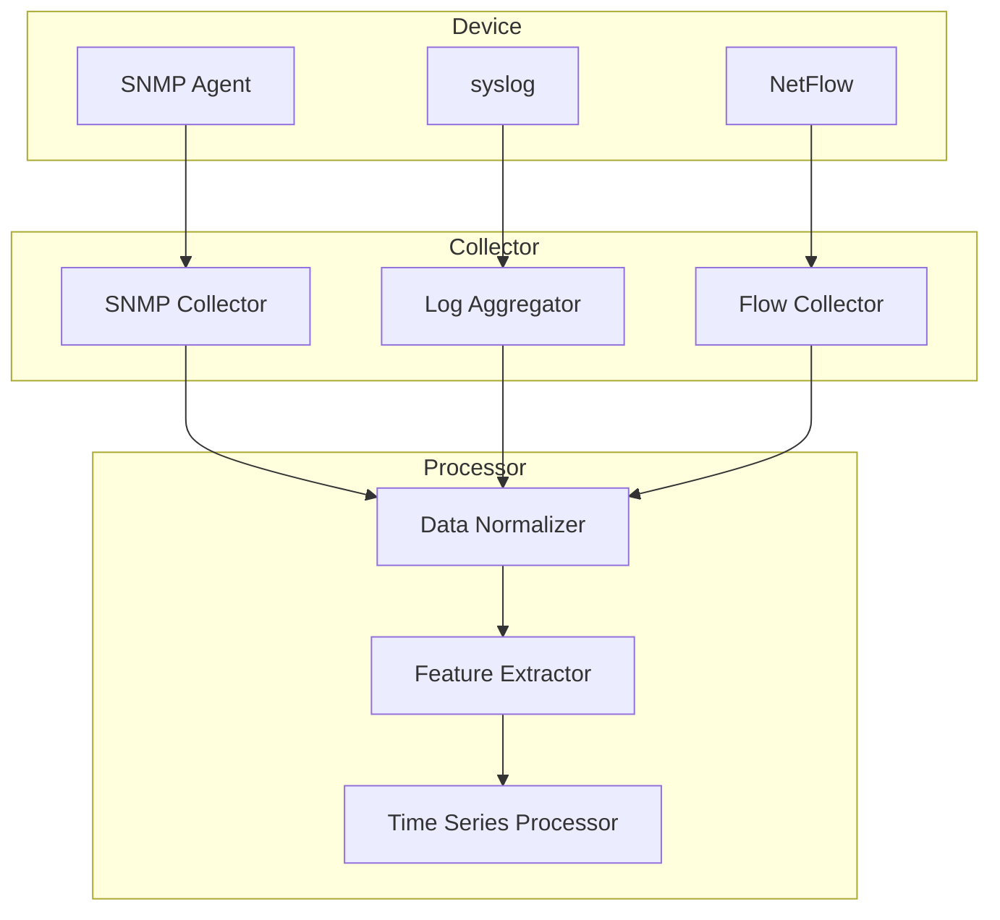

## 3. ML Pipeline

### Training Pipeline
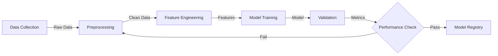

### Inference Pipeline
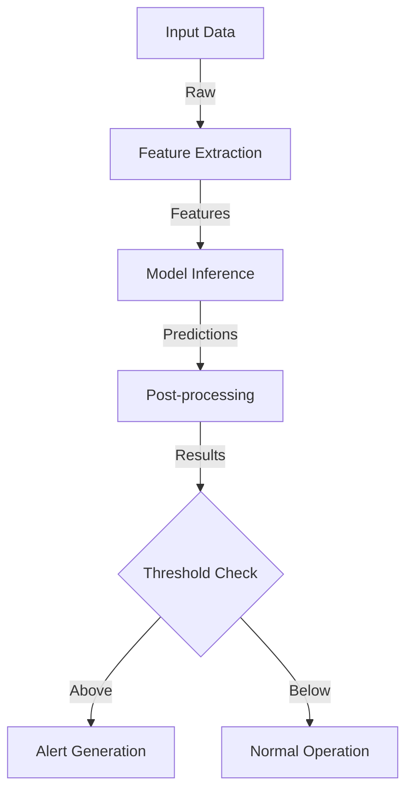

## 4. Alert System

### Alert Processing
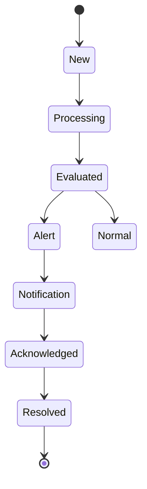

### Notification Flow
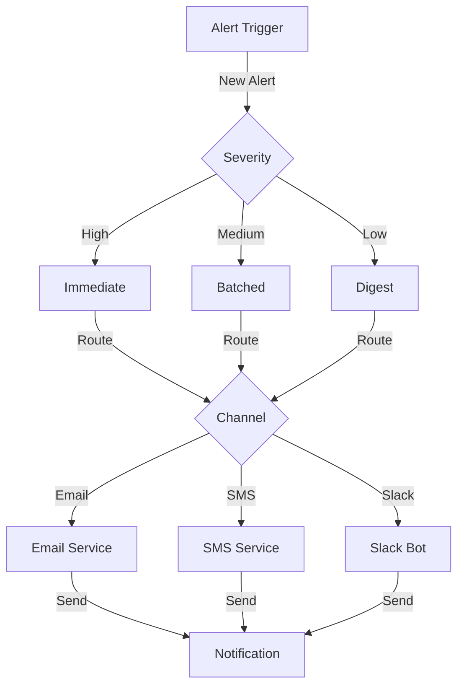

## 5. Authentication Flow

### OAuth Process
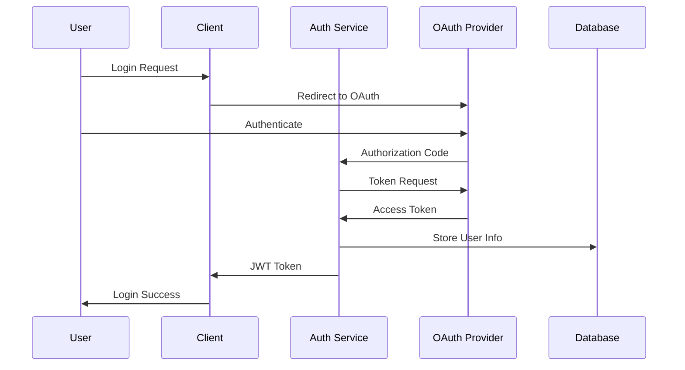

### Token Refresh
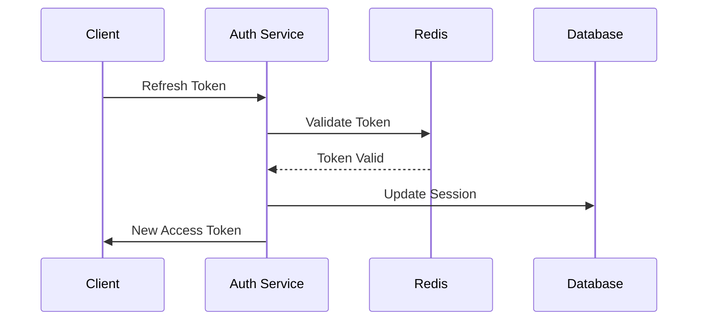

## 6. Scaling Architecture

### Horizontal Scaling
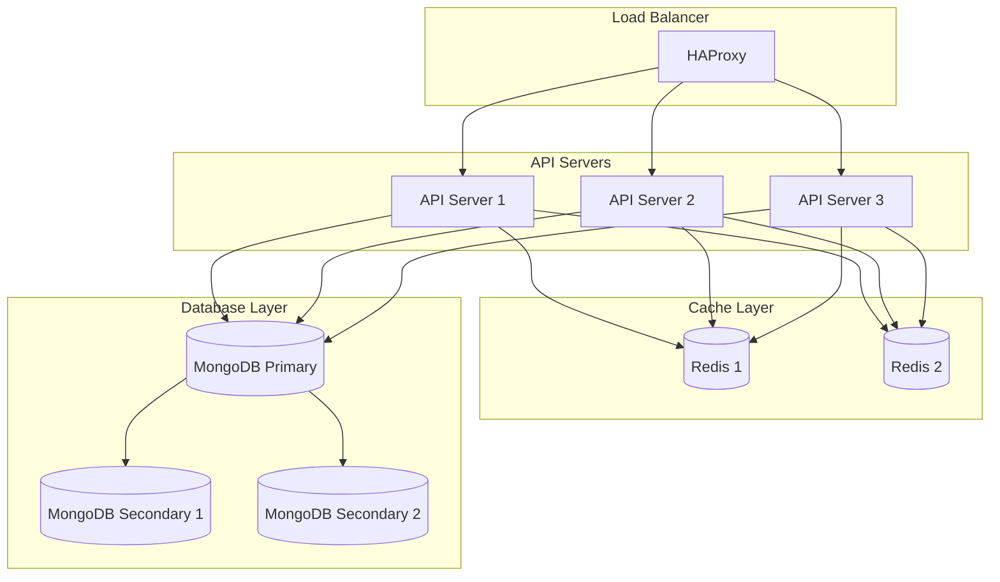

### Service Discovery
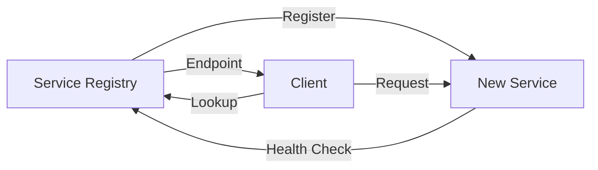

## 7. Data Models

### Device Schema
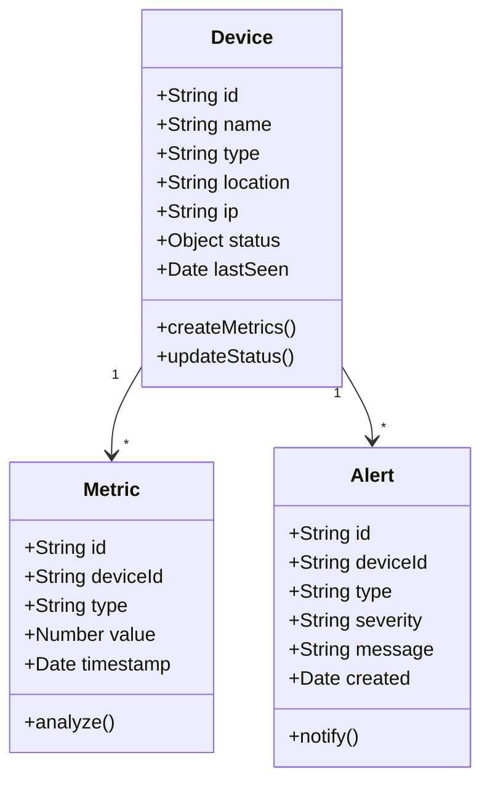

### User Schema
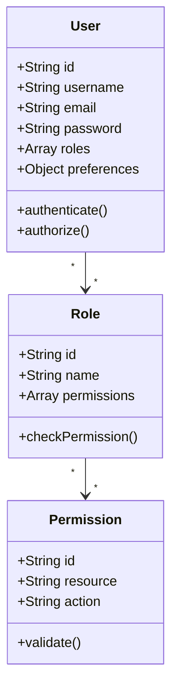
